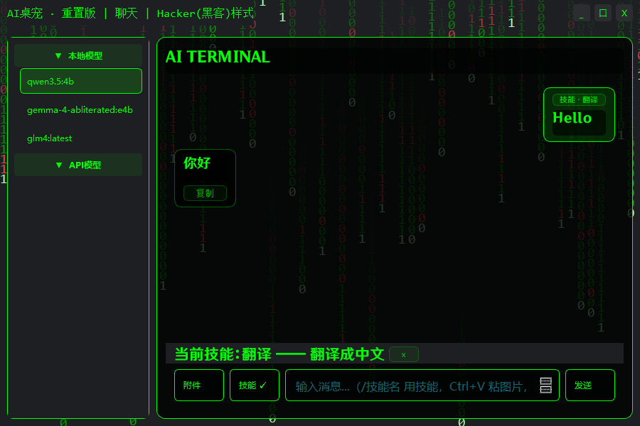
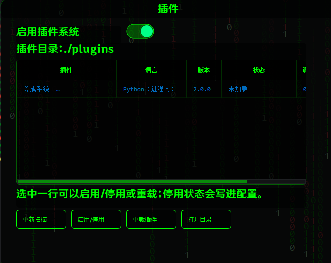
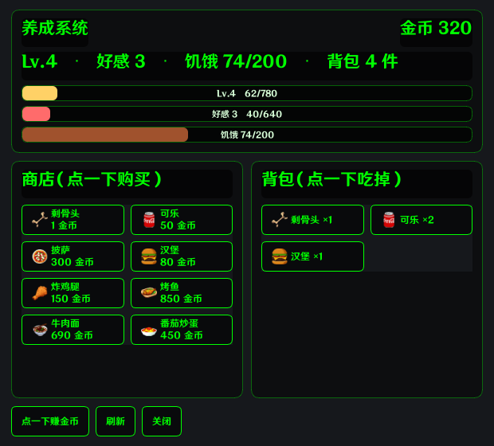
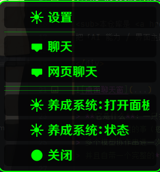

<div align="center">

# 🐾 AI Desktop Pet · Remix

**会聊天、能记事、可编程的桌面宠物** —— Live2D / 静态形象 + 本地（Ollama）或云端（OpenAI 兼容）大模型

[](https://github.com/HeavyNotFat/AIDesktopPet-Remix/actions/workflows/ci.yml)


<sub>本仓库是 <a href="https://github.com/HeavyNotFat/Agentic-AI-Desktop-Pet">Agentic-AI-Desktop-Pet</a> 的内核重构版：
把「AI 能力 / 界面主题 / 插件系统 / 外部控制」四层拆开，各自独立演化，并补上网页聊天与一整套质量门禁。</sub>

</div>



> **它是什么**：一只挂在桌面上的 Live2D 桌宠。它能陪你聊天（本地模型或云端 API 都行），
> 记得住你说过的事（短期 + 长期记忆），看得懂你贴的图片和文档，能把知识库检索、MCP 工具调用、
> 多个模型协作串进一次回答；它还能被**插件**扩展、被**任何程序**用 UDP SDK 遥控，
> 并且自带一个完整的**网页聊天**前端。

<div align="center">

|                                        🖥️ 桌面聊天                                        |                                         🧩 插件系统                                          |                                               🎮 养成玩法                                               |                                         🖱️ 右键菜单                                          |
|:--------------------------------------------------------------------------------------:|:----------------------------------------------------------------------------------------:|:---------------------------------------------------------------------------------------------------:|:-----------------------------------------------------------------------------------------:|
| [](.github/docs/showcase/chat-window.png) | [](.github/docs/showcase/plugins-page.png) | [](.github/docs/showcase/cultivation-panel.png) | [](.github/docs/showcase/context-menu.png) |

</div>

---

## 🆕 最近更新

| 内容             | 说明                                                            | 入口                                                                                                 |
|:---------------|:--------------------------------------------------------------|:---------------------------------------------------------------------------------------------------|
| **插件系统**       | Python（进程内）/ JavaScript（node 子进程）双运行时，UI Hook + 增强 Hook + 管理页 | [插件开发文档](plugins/README.md) · [最小模板](plugins/README.md#最小模板)                                       |
| **插件设置页**      | 插件在设置窗「插件」分类下加自己的页面：声明式表单或自绘 QWidget，改完直接落配置                        | [设置页导航项](plugins/README.md#4-设置页导航项)                                                             |
| **养成系统**       | 点桌宠赚金币 → 商店买吃的 → 喂食升级，AI 回复也给经验（从旧版插件移植）                      | [玩法说明](plugins/cultivation_system/README.md) · [面板截图](.github/docs/showcase/cultivation-panel.png) |
| **SDK 24 个方法** | 界面 / 聊天 / 配置 / 插件 / 记忆 六类能力 + 事件推送 + 鉴权                       | [SDK 接口说明](stlibs/sdk/README.md)                                                                   |
| **附件：图片与文档**   | Ctrl+V 粘贴、拖拽、缩略图；docx / 文本抽正文；两种后端消息形状                        | [功能详解](.github/docs/FEATURES.md#附件图片与文档)                                                           |
| **技能 Skills**  | 一段可随时套用的提示词，聊天里 `/技能名` 或点按钮                                   | [功能详解](.github/docs/FEATURES.md#聊天窗里的技能--复制--语音)                                                   |
| **多模型协作**      | 主模型出稿 → 成员评审 → 定稿，成员实例独立缓存                                    | [功能详解](.github/docs/FEATURES.md#多模型协作)                                                             |
| **网页聊天**       | FastAPI + SSE 流式 + 每会话独立实例与记忆 + 本地答案缓存                        | [HTTP 接口说明](.github/docs/API.md) · [前端目录](resources/web/onlinechat)                                        |
| **质量门禁**       | 57 项自研静态检查（UI 冲突 / 抽象契约 / 主题映射 / 前后端契约…）                      | [门禁与怎么测](.github/docs/CI.md)                                                                                |
| **结构地图**       | 每个文件干什么、启动链路、改动时要同步哪些契约                                       | [代码结构](.github/docs/STRUCTURE.md)                                                                          |

## ✨ 功能总览

| 能力               | 说明                                                                                            | 细节                                       |
|:-----------------|:----------------------------------------------------------------------------------------------|:-----------------------------------------|
| 🎭 **两种形象**      | Live2D 模型（`resources/character/model/`）或静态序列帧（`resources/character/static/`）；支持透明度、缩放、旋转、鼠标穿透 | [代码结构](.github/docs/STRUCTURE.md#43-渲染层shader)   |
| 💬 **桌面聊天窗**     | 多模型分页、流式逐字、复制/播放按钮、技能标签、附件缩略图、窗口内提示条                                                          | [功能详解](.github/docs/FEATURES.md)                 |
| 🌐 **网页聊天**      | `http://127.0.0.1:52493`，SSE 流式、断线保留已收内容、会话隔离、本地缓存                                            | [HTTP 接口](.github/docs/API.md)                   |
| 🧠 **记忆**        | 短期记忆面板可查看；长期记忆自动摘要入库并按相似度召回注入                                                                 | [功能详解](.github/docs/FEATURES.md#长期记忆)          |
| 📚 **RAG 知识库**   | 语料切块 → Ollama 向量化 → BM25 + 向量混合检索 → 注入回答                                                      | [功能详解](.github/docs/FEATURES.md)                 |
| 🛠️ **MCP 工具调用** | stdio 连接 MCP server，工具自动注入模型（示例：`mcp_servers/live2d_motion.py`）                               | [功能详解](.github/docs/FEATURES.md)                 |
| 🖼️ **多模态**      | 图片直接喂给支持视觉的模型；不支持的模型会明确提示「看不见图片」                                                              | [功能详解](.github/docs/FEATURES.md#附件图片与文档)       |
| 🎨 **可插拔主题**     | 主题包 = 一个目录 + 契约映射；自带 `hacker`（绿色终端风）与 `breeze`（清新浅色），切换只改配置                                | [代码结构](.github/docs/STRUCTURE.md#45-界面层)         |
| 🔌 **插件系统**      | 右键菜单项、聊天命令、改写回复、追加系统提示词、设置页导航项、控制动作表情、私有存储                                                    | [插件开发](plugins/README.md)                |
| 📡 **外部控制 SDK**  | UDP JSON-RPC（默认 `127.0.0.1:9000`），24 个方法 + 事件推送                                               | [SDK 说明](stlibs/sdk/README.md)           |
| 🧪 **质量门禁**      | 57 项检查 + 663 个测试用例（含离屏 Qt、node 跑前端 js）                                                        | [docs/CI.md](.github/docs/CI.md)                 |

---

## 🚀 部署

### 环境要求

| 项目     | 要求                                                               |
|:-------|:-----------------------------------------------------------------|
| 系统     | **Windows 10 / 11 x64**（鼠标穿透用 Win32 `WS_EX_TRANSPARENT`，其他平台未适配） |
| Python | **3.11+**（开发环境 3.12）                                             |
| 显存     | 不跑本地模型时不需要；跑 Ollama 建议 4GB 以上（见下方模型表）                            |
| 磁盘     | 程序本体约 200MB；每个 Live2D 模型 20–80MB；Ollama 模型另计                     |
| 可选     | **Ollama**（本地模型）、**Node.js**（JavaScript 插件与 `npx` 型 MCP 服务）      |

### 方式一：下载打包产物

到 [Releases](https://github.com/HeavyNotFat/AIDesktopPet-Remix/releases) 下载由
[`release.yml`](.github/workflows/release.yml) 在 Windows 上构建的 PyInstaller 产物，解压后运行
`AI Desktop Pet.exe（压缩包名形如 AI-Desktop-Pet-win64-<版本>.zip）`，然后跳到「配置模型」一节。

### 方式二：源码部署（推荐，便于改代码与写插件）

```bash
git clone git@github.com:HeavyNotFat/AIDesktopPet-Remix.git
cd AIDesktopPet-Remix

python -m venv .venv
.venv\Scripts\activate

pip install -r requirements.txt
python main.py
```

启动后会发生三件事（都在 `core.py` 里按顺序装配）：

1. 桌面出现桌宠（Live2D 或静态形象，取决于配置）；
2. 网页聊天服务在后台线程起来：<http://127.0.0.1:52493>；
3. 外部控制 SDK 监听 `127.0.0.1:9000`（UDP）。

只想跑网页聊天（不需要桌面/Qt）：

```bash
python -m stlibs.mproc.onlinechat
```

### 配置模型

模型配置在 `resources/configure.json`，也可以在程序的**设置页 → LLM → 新增 LLM** 里改（改完聊天列表会立刻刷新）。

**本地模型（Ollama）**

```bash
# 1. 安装并启动 Ollama（默认监听 127.0.0.1:11434）
# 2. 拉一个模型，型号按显存挑
ollama pull qwen3.5:4b        # 约 3GB，4–6GB 显存
ollama pull glm4:latest       # 纯文本，速度快
ollama pull huihui_ai/gemma-4-abliterated:e4b   # 带视觉与音频能力
```

拉完之后设置页的模型列表里就会出现它们（列表来自 `ollama list`，网页端同样可见）。

**云端模型（OpenAI 兼容）** —— 打开 `resources/configure.json`，在 `models` 里加一条：

```json
{
  "models": {
    "DSV4": {
      "name": "deepseek-flash",
      "apikey": "sk-你的key",
      "baseurl": "https://api.deepseek.com"
    }
  }
}
```

> ⚠️ `resources/configure.json` 是**会被提交**的文件：填了真实 key 就别把它推上 GitHub
> （可以改用设置页新增，或把 key 放进环境变量后自己读）。

其他常用配置项：`model_live2d` / `static_model`（形象）、`theme`（主题）、`name`（桌宠名字）、
`memory`（短/长期记忆开关）、`rag`（知识库）、`mcp`（工具服务）、`coop`（多模型协作）、`skills`（技能）、`plugins`（插件系统开关与目录）。

### 端口与环境变量

| 变量                                                         | 默认值                   | 作用                             |
|:-----------------------------------------------------------|:----------------------|:-------------------------------|
| `ONLINECHAT_HOST` / `ONLINECHAT_PORT`                      | `127.0.0.1` / `52493` | 网页聊天监听地址与端口                    |
| `WEBCHAT_MAX_SESSIONS`                                     | `8`                   | 同时保留的网页会话实例数（LRU 淘汰）           |
| `WEBCHAT_SESSION_TTL`                                      | `1800`                | 会话空闲回收秒数（`<=0` 表示不按时间回收）       |
| `WEBCHAT_MODEL_TTL`                                        | `30`                  | 模型列表缓存秒数（刷新会跑一次 `ollama list`） |
| `WEBCHAT_MAX_ATTACHMENTS` / `WEBCHAT_MAX_ATTACHMENT_CHARS` | `6` / `12MB`          | 网页端附件个数与 base64 字符上限           |
| `LLM_TIMEOUT`                                              | `120`                 | 单次模型调用超时（秒）                    |
| `ADP_SDK_TOKEN`                                            | 空                     | 设了之后 SDK 请求必须带同样 token，否则一律拒绝  |
| `ADP_NODE`                                                 | 自动探测                  | JavaScript 插件用的 node 可执行文件路径   |

### 可选组件

* **JavaScript 插件 / `npx` 型 MCP 服务**：需要 Node.js；找不到 node 时只影响 JS 插件（会在插件页显示加载失败），Python 插件照常。
* **向量库**：`chromadb`（默认）与 `lancedb` 二选一，`requirements.txt` 已都装上；切换引擎＝换库，需要重建索引。
* **RAG 语料**：把 `.txt` / `.md` 丢进 `resources/rag/<集合名>/`，在设置页开启 RAG 并点「清除缓存」重建索引。

### 常见问题

| 现象               | 原因与处理                                                                                      |
|:-----------------|:-------------------------------------------------------------------------------------------|
| 网页打不开 / 端口被占     | 换端口：`set ONLINECHAT_PORT=52500` 后重启；或检查是否有旧的 `python main.py` 在跑                           |
| 模型列表是空的          | 没启动 Ollama 或一个模型都没拉；`ollama serve` + `ollama pull <模型>`                                    |
| 贴了图片模型却说没看到      | 当前模型不支持视觉（本地模型的 `vision` 能力会探测并在界面提示），换带视觉的模型                                              |
| `live2d-py` 安装失败 | 该包对 Python 版本/平台有要求（本项目锁定 `0.3.6`）；装不上可以先用静态形象（把 `model_live2d` 留空、`static_model` 填 `fox`） |
| 插件显示「加载失败」       | 插件页会写明原因：清单坏了、入口找不到、node 缺失、hook 抛异常都会分别标注                                                 |
| 桌宠挡住鼠标操作         | Ctrl+滚轮在桌宠上缩放；模型透明区域的点击会自动穿透                                                               |

---

## 🧩 扩展这个项目

| 想做什么                       | 从哪开始                                                                                                                      |
|:---------------------------|:--------------------------------------------------------------------------------------------------------------------------|
| 写一个插件（Python / JavaScript） | [插件开发文档](plugins/README.md)：清单字段、hook 一览、API 参数表、两种语言的最小模板                                                                |
| 做完整玩法（带界面 + 数值 + 存档）       | [养成系统](plugins/cultivation_system/README.md)：`cultivation_model.py`（纯逻辑）+ `cultivation_window.py`（界面）+ `main.py`（hook 接线） |
| 写个外部程序遥控桌宠                 | [SDK 接口说明](stlibs/sdk/README.md)：24 个方法 + 事件订阅，一行一个 JSON 的 UDP 报文                                                         |
| 接自己的聊天前端                   | [HTTP 接口说明](.github/docs/API.md)：8 个接口 + SSE 事件格式                                                                                 |
| 换一套界面主题                    | [代码结构 §4.5](.github/docs/STRUCTURE.md#45-界面层)：主题包 = 目录 + 契约映射；照 `hacker`（深色）或 `breeze`（浅色）写，`tests/test_breeze_theme.py` 是契约清单 |
| 改 AI 行为（提示词 / RAG / 工具）    | `resources/prompts.json`（提示词）、`stlibs/ai/`（后端与检索）、`mcp_servers/`（工具服务）                                                    |

---

## 📚 文档索引

所有项目文档都收在 `docs/` 下（各目录的 `README.md` 跟着代码走，不搬家）：

| 文档                                                                           | 内容                                                 |
|:-----------------------------------------------------------------------------|:---------------------------------------------------|
| [README.md](README.md)                                                       | 你正在看的这一页：功能总览、部署、文档索引                              |
| [docs/README.md](.github/docs/README.md)                                             | **文档总目录**：所有文档的统一入口                                |
| [docs/API.md](.github/docs/API.md)                                                   | **网页聊天 HTTP 接口**：8 个接口的地址/用途/请求参数表/返回值解析/错误码       |
| [docs/CI.md](.github/docs/CI.md)                                                     | **质量门禁与「怎么测」**：57 项检查清单、测试矩阵、真机联调步骤                |
| [docs/STRUCTURE.md](.github/docs/STRUCTURE.md)                                       | **代码结构与职责地图**：每个文件干什么、启动链路、契约同步点、已核实的问题清单          |
| [docs/FEATURES.md](.github/docs/FEATURES.md)                                         | **功能详解**：长期记忆、多模型协作、提示条、模型刷新、技能、附件、插件、养成、SDK       |
| [docs/PROMPT.md](.github/docs/PROMPT.md)                                             | 人设提示词草稿（与 `resources/prompts.json` 的 `general` 同源） |
| [plugins/README.md](plugins/README.md)                                       | **插件开发**：清单字段、hook 一览、API 参数表、两种语言模板、调试技巧、安全边界     |
| [plugins/cultivation_system/README.md](plugins/cultivation_system/README.md) | **养成系统**：玩法、hook 接线、与旧版差异、数值公式                     |
| [stlibs/sdk/README.md](stlibs/sdk/README.md)                                 | **SDK 接口说明**：12 组方法的参数与返回值、事件推送、五种报文格式、安全说明        |

## 🧪 质量门禁与测试

```bash
python -m tools.ci            # 57 项静态检查：UI 冲突 / 抽象契约 / 主题映射 / 配置与前后端契约
python -m pytest tests -q     # 663 个用例：单元 + 离屏 Qt + node 跑前端 js + 门禁自测
```

门禁不依赖任何第三方库，支持 `# ci: ignore[=id]` 内联抑制与五种输出格式（text / json / markdown / github / sarif）；
CI 会在每次 push 时跑门禁、ruff、`compileall` 与多 Python
版本测试矩阵（见 [.github/workflows/ci.yml](.github/workflows/ci.yml)）。

真机联调脚本（需要本机跑着 Ollama）：

```bash
python tools/manual/probe_onlinechat.py glm4:latest   # 网页聊天：实例隔离 + 流式
python tools/manual/probe_attachment.py glm4:latest   # 附件：消息形状 + 文档暗号
python tools/manual/probe_plugin.py glm4:latest       # 插件：双语言 + hook + 系统提示词
python tools/manual/probe_cultivation.py              # 养成系统：菜单/命令/面板
python tools/manual/shoot_ui.py                       # 离屏出图：提示条/设置页/菜单/面板/聊天窗
```

## 🗂️ 项目结构（简版）

```
ADPRemix/
├── main.py / core.py        进程入口与总装线（起 SDK、网页服务、桌宠、插件）
├── docs/                    项目文档：API / CI / 结构 / 功能详解 / 人设草稿（+ showcase 截图）
├── shader/                  渲染：OpenGL 画布 + Live2D 形象 + 静态形象
├── stlibs/                  核心库
│   ├── ai/                  模型能力：local/cloud 后端、附件、RAG、函数调用、MCP、长期记忆、协作
│   ├── themes/              可插拔主题（hacker / breeze）+ 主题契约
│   ├── graphics/            聊天窗与设置窗装配
│   ├── plugins/             插件系统（管理子包 + JS 运行时）
│   ├── sdk/                 外部控制 SDK（服务端/客户端/方法表）
│   ├── mproc/onlinechat/    网页聊天服务端（FastAPI + 实例池）
│   └── derfer/              QThread 线程边界与音频播放
├── plugins/                 插件目录：两个示例 + 养成系统
├── mcp_servers/             暴露给模型的 MCP 工具服务
├── resources/               配置、提示词、模型、语料、字体图标、网页前端
├── tools/ci/                自研门禁（57 项）；tools/manual/ 联调与出图脚本
└── tests/                   663 个用例
```

逐文件说明、启动链路与调用链见 [docs/STRUCTURE.md](.github/docs/STRUCTURE.md)。

## ⚠️ 已知平台行为

PySide6 下 Qt 子类的 `@abstractmethod` **在运行期不生效**
（`Shiboken.ObjectType.__new__` 排在 `ABCMeta.__new__` 前面，`__abstractmethods__` 不会生成）。
因此主题/界面契约由 `tools/ci` 的 `abs/*` 检查在提交阶段静态保证，
并有金丝雀测试记录该行为（`tests/test_platform_behaviour.py`）。

## 📄 许可

[GPL-3.0](LICENSE)。二次开发请保留原始版权声明；Live2D 模型与字体资源的版权归各自作者所有，请自行确认使用范围。

---

<div align="center">

📧 联系作者：2953911716@qq.com ｜ 💬 [Discussions](https://github.com/HeavyNotFat/AIDesktopPet-Remix/discussions)

<a href="https://www.star-history.com/#HeavyNotFat/AIDesktopPet-Remix&Date">
 <picture>
  <source media="(prefers-color-scheme: dark)" srcset="https://api.star-history.com/svg?repos=HeavyNotFat/AIDesktopPet-Remix&type=Date&theme=dark" />
  <source media="(prefers-color-scheme: light)" srcset="https://api.star-history.com/svg?repos=HeavyNotFat/AIDesktopPet-Remix&type=Date" />
  
 </picture>
</a>

<sub>如果这个项目对你有帮助，点个 ⭐ 就是最大的支持。</sub>

</div>
